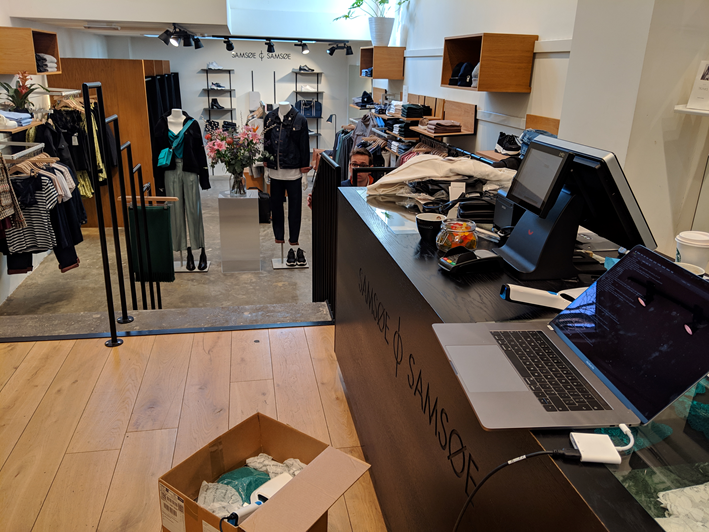
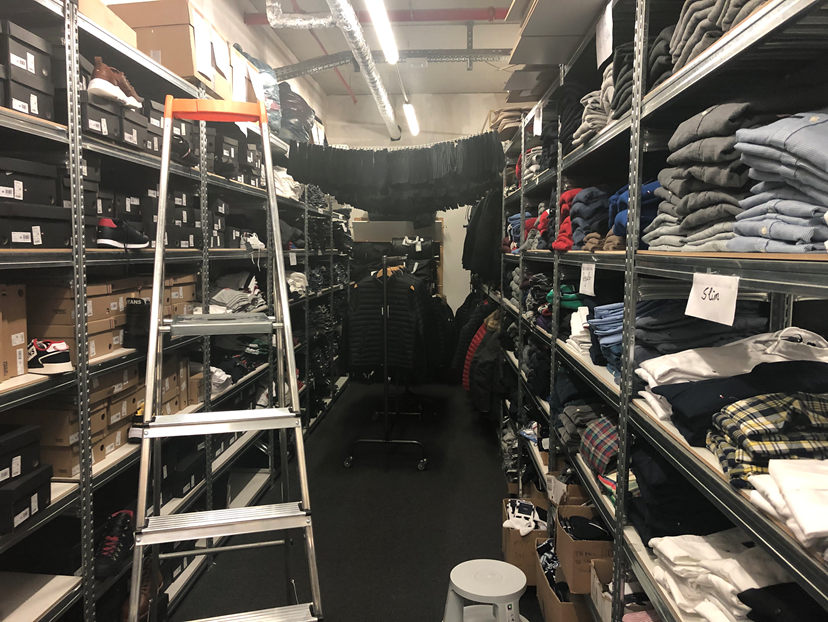

# DevDay 2019 - Retail RFID Label Scanning

In this data science mini-hackathon we are going to work with a real-life problem from Nedap Retail. In the world of RFID label scanning, it is very hard to isolate products since the entire store is filled with RFID tags (see Figure 1 and Figure 2). Our challenge is to come up with an algorithm to do this separation automatically when scanning a batch of newly arriving products.

You are going to develop and evaluate a basic machine learning pipeline to address the case above. We give you all the tools needed to get started with basic machine learning to show you the power of these algorithms.

**Figure 1: scanning RFID labels in a typical retail store**



**Figure 2: label scanning can be noisy**




## Environment

We will run our experiment environment in Docker. Make sure you have docker installed: [installation instructions](https://docs.docker.com/v17.09/engine/installation/#supported-platforms).

Afterwards, you can clone this repository to a location of your choice:

```sh
git clone https://github.com/nedap/dev-day-rfidtags.git
```

Finally, start the docker container and visit http://localhost:8888/notebooks/work/notebooks/rfid-classification.ipynb (token: `devday`).

```sh
cd dev-day-rfidtags/
docker-compose up
```
